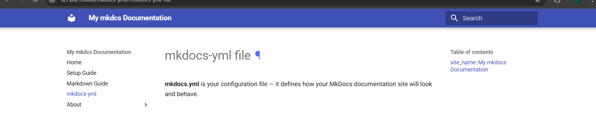
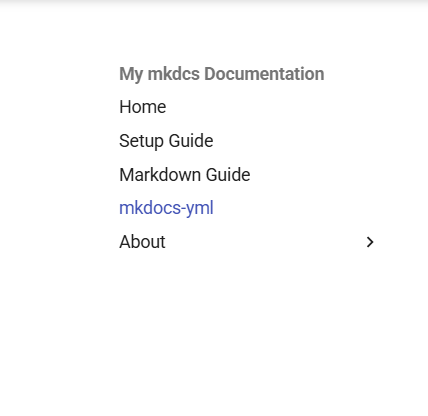
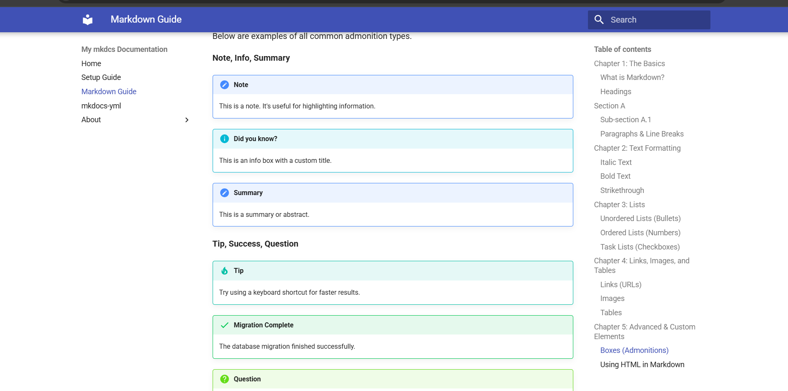

# **mkdocs-yml file**

**mkdocs.yml** is your configuration file — it defines how your MkDocs documentation site will look and behave. 

## **site_name: My mkdocs Documentation**

- This sets the title of your documentation site.
- Appears in the site header and browser tab.



---

## **nav: (Navigation Menu)**

- Defines the navigation structure (the sidebar or top menu of your site).
- Each item points to a Markdown file (.md) inside your project.
- Appears differently in different themes.

```markdown
nav:
    - Home: index.md
    - Setup Guide: setup-guide.md
    - Markdown Guide: markdown-guide.md
    - mkdocs-yml : mkdocs-yml.md 
    - About: 
      - about: about.md
      - about us : aboutUs.md
```
Screenshot:



---

## **extra_css**

- Here you add custom CSS to style your site in mkdocs.yml file.
- We need to write custom css even if we want to remove any pre created element.

```markdown
extra_css:
    - css/custom.css
```

---

## **theme**

- Here we can change theme
- material theme comes with the basic mkdocs package.

```markdown
theme: 
  name: material
```

---


## **markdown_extensions:**

- *These extend the default Markdown behavior:*

### toc (Table of Contents) : 

```markdown
- toc:
    permalink: true
    toc_depth: 2-3
```

- permalink: true → Adds clickable anchor links (#) to headings.
- toc_depth: 2-3 → Only show headings H2 and H3 in the sidebar TOC.

 ---

### admonition :

- Adds note/warning/info boxes like:

```markdown
!!! note
    This is a note box.
```

screenshot:



---


