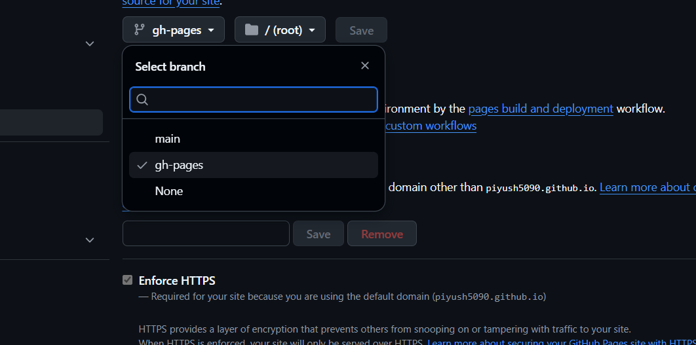

# Full Setup Guide: From Python to a Live Site

This guide provides a complete walkthrough of all the steps needed to create a documentation website using MkDocs, starting from zero.

---

## **Step 1: Installing Python**

Python is the programming language that runs MkDocs. You must have it installed first.

1.  **Check if you have Python:** Open your command line or terminal and type:
    ```bash
    python --version
    ```
    If you see a version number (e.g., `Python 3.9.5`), you already have it. If you get an error, you need to install it.

2.  **Download Python:** Go to the official Python website: [https://www.python.org/downloads/](https://www.python.org/downloads/)

3.  **Run the Installer:**
    - Download the latest version for your operating system (Windows, macOS, Linux).
    - Run the installer.
    - **Important (for Windows):** On the first screen of the installer, make sure to check the box that says **"Add Python to PATH"**. This will make it much easier to run Python from the command line.

4.  **Verify the Installation:** Close and reopen your terminal and run `python --version` again. You should now see the version number.

---

## **Step 2: Installing MkDocs**

MkDocs is a Python package. You can install it using `pip`, the Python Package Installer, which comes included with modern versions of Python.

1.  **Open your terminal or command line.**
2.  **Run the installation command:**
    ```bash
    pip install mkdocs
    ```
    This will download and install the MkDocs package and its dependencies.

3.  **(Optional) Install a Theme:** To get advanced features like a right-side navigation menu, it's best to install a theme like Material for MkDocs:
    ```bash
    pip install mkdocs-material
    ```

---

## **Step 3: Creating Your Documentation Project**

Now that the software is installed, you can create your project.

1.  **Navigate to where you want your project:** In your terminal, use the `cd` (change directory) command to go to the folder where you want to create your project (e.g., `cd Desktop`).

2.  **Create the project:** Run the `mkdocs new` command followed by the name of your project folder.
    ```bash
    mkdocs new my-new-docs
    ```

3.  **Review the files:** This command creates a new folder named `my-new-docs` with the following structure:
    ```
    my-new-docs/
    ├── mkdocs.yml   # The main configuration file.
    └── docs/
        └── index.md # The homepage for your documentation.
    ```

---

## **Step 4: Adding and Editing Content**

1.  **Edit the Homepage:** Open the `docs/index.md` file in a text editor and change its content. You can use the Markdown syntax detailed in this project's README.

2.  **Create New Pages:** To add more pages, simply create new `.md` files inside the `docs/` folder. For example, you could create `docs/install-guide.md`.

3.  **Configure the Site Navigation:** To make your new pages appear in the site's navigation menu, you must edit the `mkdocs.yml` file and add a `nav` section.

    **Example `mkdocs.yml`:**
    ```yaml
    site_name: My Awesome Docs

    nav:
      - 'Home': 'index.md'
      - 'Installation': 'install-guide.md'
    ```

---

## **Step 5: Key MkDocs Features & Commands**

### See Your Site Locally

To preview your website as you are working on it, navigate into your project folder (`cd my-new-docs`) and run:

```bash
mkdocs serve
```

This starts a local web server at `http://127.0.0.1:8000/`. Open this URL in your browser. The site will automatically refresh whenever you save a file.

### Change the Theme

To use a theme you installed (like Material), edit the `theme` section in `mkdocs.yml`.

```yaml
site_name: My Awesome Docs

nav:
  - 'Home': 'index.md'

theme:
  name: material
```

### Build the Final Website

- First, generate the static site:

```bash
mkdocs build
```

*This will create a site/ folder with all your HTML/CSS/JS files.*

---

- Push your MkDocs project to GitHub.
(Make sure your repo has mkdocs.yml and docs/.)
- Deploy with:

```markdown
mkdocs gh-deploy
```

- MkDocs will build and push your site to a branch called gh-pages.
- Then your site will be available at:

```markdown
https://<username>.github.io/<repo>/
```


---


